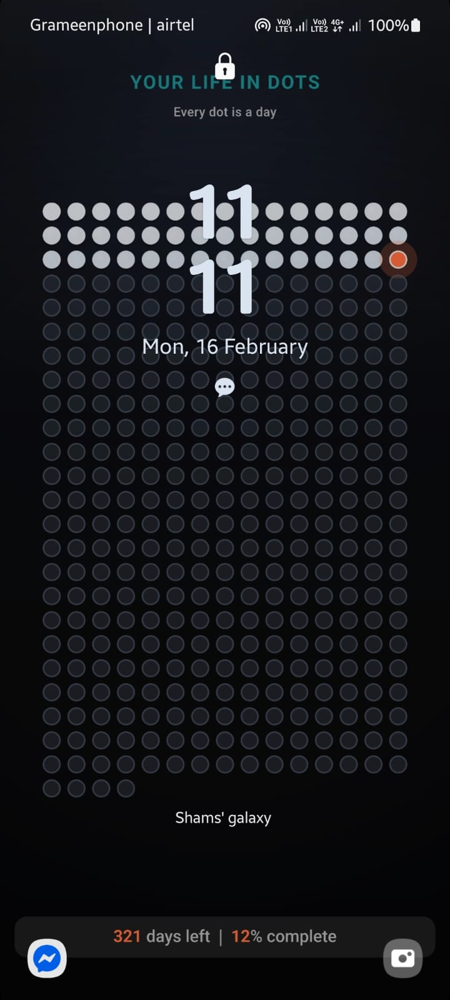
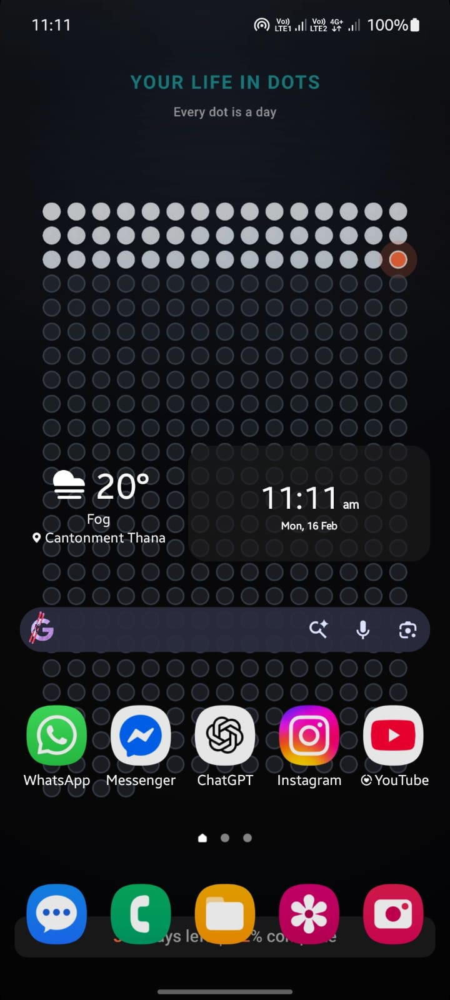
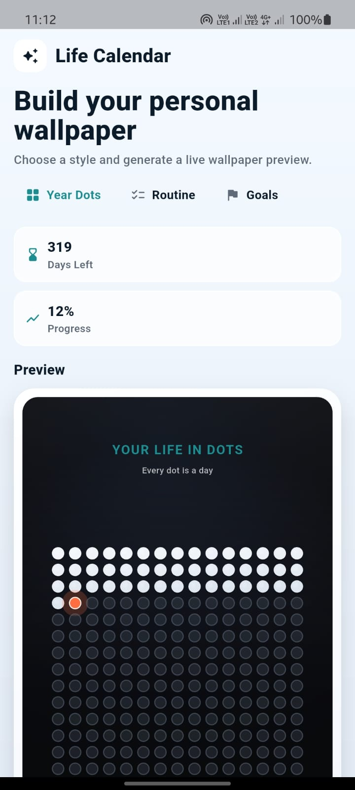
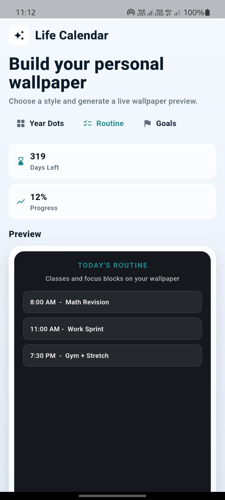

# Resonance - A Life Wallpaper App 📅

My own implementation of the **Life Calendar** concept — a visual representation of your year as a grid of dots, designed to be set as your phone wallpaper.

## About

This Flutter app generates a beautiful wallpaper that displays every day of the year as a dot. It serves as a daily reminder of how much of the year has passed and how much remains — helping you stay mindful of time and motivated to make each day count.

## Features

-  **Custom Wallpaper Generation** — Creates a stunning dot-grid calendar wallpaper
-  **Device-Adaptive** — Renders at your device's native resolution and aspect ratio
-  **Visual Progress Tracking** — Shows elapsed days, current day, and remaining days
-  **Current Day Highlight** — The current day is highlighted in accent color
-  **Week Counter** — Displays weeks passed and weeks remaining in the year
-  **One-Tap Wallpaper Set** — Save and set as wallpaper directly from the app


## Preview

### Wallpaper Preview

<table>
  <tr>
    <td align="center">
      
      <br />
      <sub>Lock Screen</sub>
    </td>
    <td align="center">
      
      <br />
      <sub>Home Screen</sub>
    </td>
  </tr>
  <tr>
    <td align="center">
      
      <br />
      <sub>App Home UI</sub>
    </td>
    <td align="center">
      
      <br />
      <sub>App Home UI Routine Wallpaper</sub>
    </td>
  </tr>
</table>


## How It Works

The app uses a `CustomPainter` to render a grid of 364 dots (52 weeks × 7 days) arranged in rows. The layout is fully configurable through `CalendarGridLayout`:

| Parameter | Default | Description |
|-----------|---------|-------------|
| `totalDots` | 364 | Total dots to display |
| `dotsPerRow` | 15 | Dots per row |
| `verticalPaddingRatio` | 0.22 | Top/bottom padding |
| `dotRadiusRatio` | 0.02 | Dot size relative to screen width |

## Getting Started

### Prerequisites

- Flutter SDK ^3.10.4
- Android/iOS device or emulator

### Installation

1. Clone the repository:
   ```bash
   git clone https://github.com/shamspahlowan/life_calender.git
   ```

2. Navigate to the project directory:
   ```bash
   cd life_calender
   ```

3. Install dependencies:
   ```bash
   flutter pub get
   ```

4. Run the app:
   ```bash
   flutter run
   ```

## Usage

1. Launch the app
2. Preview your life calendar wallpaper
3. Tap **"Save Wallpaper"** to generate and set it as your device wallpaper


## Platforms

- ✅ Android

## Dependencies

- `flutter` — UI framework
- `path_provider` — File system access for saving wallpapers


*Made with ❤️ by [shamspahlowan](https://github.com/shamspahlowan)*


